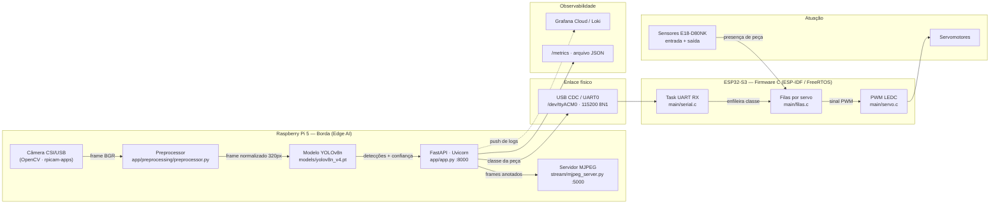
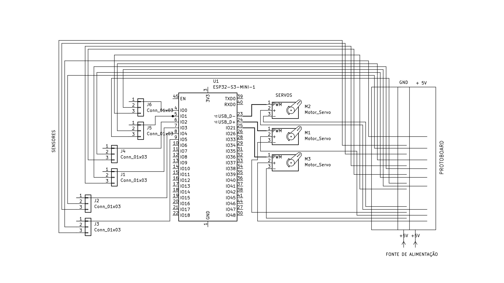
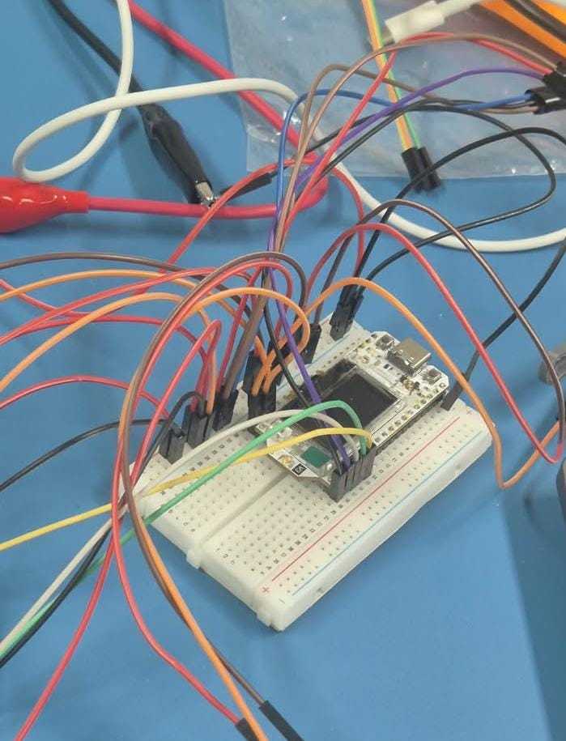
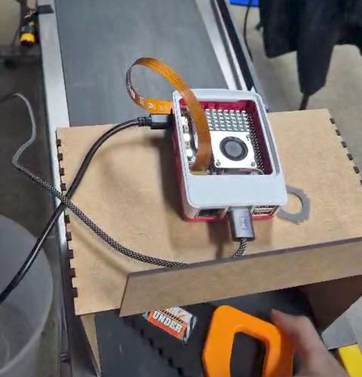
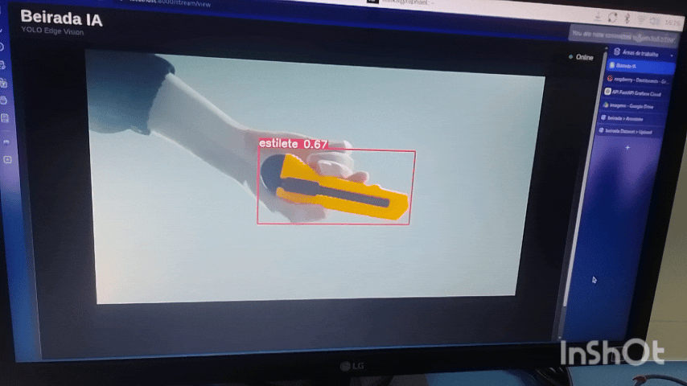
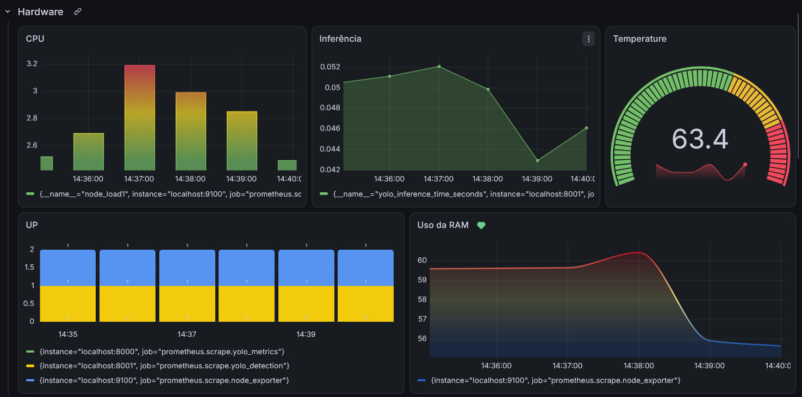
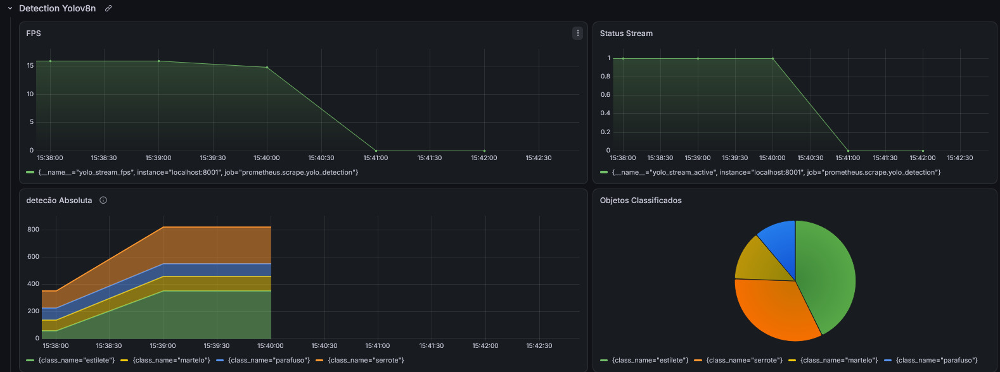

# Projeto V.I.T.A. - Visão Inteligente de Triagem Automática

> **Equipe Computação na Beirada:**
> - Dorian Dayvid Gomes Feitosa
> - Esdras Rodrigues de Andrade
> - Manuela Menezes Alves
> - Raphael Sousa Rabelo Rates

---

## Sumário

**Parte I: Entendimento da solução**
1. [Visão Geral](#1-visão-geral)
2. [Diagrama de Arquitetura](#2-diagrama-de-arquitetura)
3. [Esquemático elétrico](#3-esquemático-elétrico)
4. [Tabela de pinagem](#4-tabela-de-pinagem)
5. [Componentes da Solução](#5-componentes-da-solução)
6. [Estrutura das Pastas](#6-estrutura-das-pastas)
7. [Protocolo de comunicação RPi ↔ ESP32](#7-protocolo-de-comunicação-rpi--esp32)
8. [Dependências](#8-dependências)

**Parte II: Manual de replicação**

- [Pré-requisitos](#pré-requisitos)
- [Passo 1: Montagem física do hardware](#passo-1-montagem-física-do-hardware)
- [Passo 2: Preparação do Raspberry Pi 5](#passo-2-preparação-do-raspberry-pi-5)
- [Passo 3: Compilação e gravação do firmware](#passo-3-compilação-e-gravação-do-firmware-esp32-s3)
- [Passo 4: Configuração do sistema](#passo-4-configuração-do-sistema)
- [Passo 5: Execução](#passo-5-execução)
- [Passo 6: Verificação do resultado](#passo-6-verificação-do-resultado)
- [Passo 7: Troubleshooting](#passo-7-troubleshooting)

---

# PARTE 1: EXPLICAÇÃO DA SOLUÇÃO

## 1. Visão Geral

### O Problema

Em uma planta de manufatura avançada, peças recém-usinadas ou impressas em 3D trafegam **completamente misturadas** por uma esteira principal. Elas se acumulam durante o trajeto, gerando sobreposições esporádicas e posições aleatórias. Essa desordem inviabiliza a triagem eficiente e a alimentação padronizada das estações de montagem seguintes, criando gargalos e atrasando o ritmo de produção.

### A Solução

O **Projeto V.I.T.A.** é uma solução embarcada para identificação, monitoramento e triagem automática de componentes em uma linha de produção.

A arquitetura utiliza uma câmera conectada a uma **Raspberry Pi 5** para captura contínua de imagem. Uma API de inferência em Python (`yolo-api`) baseada em **YOLOv8** processa os frames e classifica as peças em tempo real. Os resultados são transmitidos via porta serial USB para um microcontrolador **ESP32-S3**, que gerencia filas de prioridade e aciona servomotores para o desvio das peças. O sistema também disponibiliza um servidor de streaming MJPEG para visualização web em tempo real.

---

## 2. Diagrama de Arquitetura



### Fluxo de um ciclo completo

1. A câmera captura um frame da esteira.
2. O `Preprocessor` aplica letterbox e redimensiona para 320 px (configurável).
3. O YOLOv8n infere as bounding boxes e classes presentes.
4. Detecções com confiança ≥ `CONFIDENCE` (padrão 0,70) viram um comando de classe.
5. A classe é enviada como texto ASCII pela serial USB.
6. A task UART do ESP32 lê a linha e chama `peca_para_fila()`.
7. A fila FreeRTOS do servo correspondente recebe o item; a task do servo desperta.
8. A task aguarda o **sensor de entrada** acusar a peça e então abre o servo.
9. Ao **sensor de saída** confirmar a transferência, o servo volta à posição de repouso (90°).

---

## 3. Esquemático elétrico

<p align="left">
    
</p>

A protoboard é utilizada como ponto de distribuição da alimentação e de referência de terra entre os componentes do sistema. Os sensores E18-D80NK e os servomotores possuem suas conexões de alimentação ligadas aos barramentos correspondentes da protoboard.

- Barramento positivo (+): conectado à saída de +5 V da fonte externa, fornecendo alimentação aos sensores e aos servomotores.
- Barramento negativo (−): conectado ao GND da fonte externa e ao GND do ESP32-S3, estabelecendo uma referência de terra comum para o sistema.
- Sensores E18-D80NK: cada sensor possui alimentação conectada aos barramentos de +5 V e GND, enquanto o pino de saída é conectado ao respectivo GPIO do ESP32-S3.
- Servomotores: cada servo recebe +5 V e GND através da protoboard, enquanto o fio de sinal é conectado ao GPIO correspondente do ESP32-S3.
- ESP32-S3: utiliza a protoboard para compartilhar a referência de GND e realizar as conexões de sinal com os sensores e servomotores.

A alimentação é realizada pela fonte externa de 5 V, com capacidade mínima de 3 A.

### 3.1 Montagem na protoboard
<p align="left">
    
</p>

---

## 4. Tabela de pinagem

Valores definidos em [`beirada_esp/ledc_basic/main/servo.h`](beirada_esp/ledc_basic/main/servo.h). Alterar o hardware exige editar esse arquivo e recompilar o firmware.

### Servomotores (saída PWM via periférico LEDC)

| Constante | GPIO | Canal LEDC | Posição na esteira |
|---|---|---|---|
| `SERVO1_GPIO` | 20 | `LEDC_CHANNEL_0` | Desvio 1 |
| `SERVO2_GPIO` | 7  | `LEDC_CHANNEL_1` | Desvio 2 |
| `SERVO3_GPIO` | 26 | `LEDC_CHANNEL_2` | Desvio 3 |

### Sensores ópticos E18-D80NK (entrada digital, pull-up interno)

| Constante | GPIO | Função |
|---|---|---|
| `SENSOR1_ENTRADA_GPIO` | 4  | Dispara o servo 1 |
| `SENSOR2_ENTRADA_GPIO` | 38 | Dispara o servo 2 |
| `SENSOR3_ENTRADA_GPIO` | 39 | Dispara o servo 3 |
| `SENSOR1_SAIDA_GPIO`   | 5  | Confirma transferência e recolhe o servo 1 |
| `SENSOR2_SAIDA_GPIO`   | 16 | Confirma transferência e recolhe o servo 2 |
| `SENSOR3_SAIDA_GPIO`   | 17 | Confirma transferência e recolhe o servo 3 |

**Lógica de leitura:** nível **LOW (0) = objeto detectado**. O E18-D80NK é NPN normalmente aberto; com pull-up interno habilitado, o pino repousa em HIGH e vai a LOW quando o feixe é interrompido.

### Parâmetros de PWM

| Parâmetro | Valor | Observação |
|---|---|---|
| Frequência | 50 Hz | Padrão de servos hobby |
| Resolução | 14 bits (`LEDC_TIMER_14_BIT`) | Duty máximo 16383 |
| Pulso mínimo | 500 µs | Corresponde a 0° |
| Pulso máximo | 2500 µs | Corresponde a 180° |
| Repouso | 90° | Braço paralelo à esteira |
| Acionado | 150° (servo 2: 50°) | O servo 2 é espelhado por estar no lado oposto |
---

## 5. Componentes da Solução

### Hardware
| Componente | Função na arquitetura |
|---|---|
| Câmera | Sensor óptico de entrada para captura de quadros da esteira. |
| Raspberry Pi 5 | Unidade central de processamento em borda (Edge AI), hospedagem da API e servidor de streaming.|
| ESP32-S3 | Microcontrolador de tempo real executando firmware determinístico em C (ESP-IDF/FreeRTOS). |
| Servomotores | Atuadores mecânicos responsáveis pelo desvio físico dos componentes. |

### Software
| Camada | Tecnologia | Versão | Função |
|---|---|---|---|
| Modelo de IA | Ultralytics YOLOv8n | 8.2.0 | Detecção e classificação das peças em tempo real |
| API de inferência | FastAPI + Uvicorn | 0.111.0 / 0.29.0 | Expõe `/predict`, `/predict/image`, `/predict/batch`, `/health`, `/metrics` |
| Streaming | Flask | 3.1.3 | Servidor MJPEG com detecções sobrepostas (`stream/mjpeg_server.py`) |
| Pré-processamento | OpenCV + Pillow + NumPy | 4.9.0.80 / 11.0.0 / 1.26.4 | Letterbox, resize e filtros de imagem antes da inferência |
| Comunicação IoT | pyserial | 3.5.0 | Envio da classe detectada ao ESP32-S3 via USB serial |
| Firmware embarcado | ESP-IDF / FreeRTOS (C) | -- | Lógica de filas por servo e acionamento via LEDC/GPIO |
| Versionamento de modelo | DVC | -- | Rastreamento do arquivo `yolov8n.pt` fora do Git |
| Orquestração | Docker Compose | -- | Sobe os serviços `yolo-api`, `yolo-stream` e `yolo-client` |
---

## 6. Estrutura das Pastas

```
Projeto-Beirada/
├── README.md
├── LICENSE
├── docker-compose.yml          # Orquestra os 3 serviços
├── .dvc/config                 # Remote do DVC (ver Passo 4)
├── .github/workflows/
│   └── beirada_deploy.yml      # CI/CD
│
├── docs/
│   └── imagens/                # Imagens e gifs do README
│
├── beirada_esp/                # -- FIRMWARE (ESP32-S3) --
│   └── ledc_basic/
│       ├── CMakeLists.txt
│       └── main/
│           ├── ledc_basic_example_main.c   # app_main: inicializa servos, filas, serial
│           ├── servo.c / servo.h           # Pinagem, PWM LEDC, leitura de sensores
│           ├── filas.c / filas.h           # Uma fila + uma task FreeRTOS por servo
│           └── serial.c / serial.h         # Task UART: lê a classe vinda do RPi
│
└── beirada_ia/                 # -- VISÃO COMPUTACIONAL (RPi 5) --
    ├── Dockerfile.api
    ├── Dockerfile.client
    ├── ruff.toml
    ├── app/
    │   ├── app.py              # Aplicação FastAPI e todos os endpoints
    │   ├── model.py            # Carregamento e cache do modelo YOLO
    │   ├── schemas.py          # Contratos Pydantic de entrada/saída
    │   ├── requirements.txt
    │   ├── .env.grafana        # Credenciais do Grafana Cloud (preencher)
    │   ├── core/               # Instâncias singleton (app, preprocessor, templates)
    │   ├── preprocessing/
    │   │   ├── preprocessor.py # Pipeline configurável de pré-processamento
    │   │   ├── utils/          # letterbox e utilitários
    │   │   └── experiments/    # Iterações de teste - fora do fluxo de produção
    │   ├── static/ · templates/# Interface web de visualização
    │   └── output/             # Métricas persistidas
    ├── client/
    │   └── client.py           # Cliente de teste: envia imagens à API
    ├── dataset/                # Dataset e script de treino
    ├── models/                 # Pesos versionados via DVC (.pt.dvc)
    ├── scripts/
    │   ├── deploy.sh
    │   ├── inspect_dataset.py
    │   └── validate_model.py
    ├── stream/
    │   ├── mjpeg_server.py     # Servidor MJPEG de produção
    │   ├── v3_optimized.py     # Cmera + detector otimizados (em uso)
    │   ├── v1_naive.py / v2_threaded.py   # Iterações anteriores - documentação
    │   └── raw_server.py / captire_frames.py
    └── tests/
        ├── test_api.py
        └── test_preprocessor.py
```

---

## 7. Protocolo de comunicação RPi ↔ ESP32

Enlace cabeado, sem dependência de rede sem fio.

| Parâmetro | Valor |
|---|---|
| Meio físico | USB CDC (UART0 do ESP32-S3) |
| Dispositivo no RPi | `/dev/ttyACM0` |
| Baud rate | 115200 |
| Formato | 8 bits de dados, sem paridade, 1 stop bit (8N1) |
| Controle de fluxo | Desabilitado |

### Formato da mensagem

Texto ASCII, um comando por linha, terminado em `\n` ou `\r`:

```
<classe>\n
```

Onde `<classe>` é um inteiro de **1 a 3** (limite atual `SERVO_MAX_COUNT`), mapeado para o servo `classe - 1`.

| Enviado pelo RPi | Ação no ESP32 |
|---|---|
| `1\n` | Enfileira peça para o servo 1 |
| `2\n` | Enfileira peça para o servo 2 |
| `3\n` | Enfileira peça para o servo 3 |
| Valor fora de 1–3 | Descartado, com log `Classe inválida recebida` |

O parser em `serial.c` ignora qualquer caractere que não seja dígito, então ruído na linha não corrompe o comando. Cada fila comporta até 10 itens pendentes; ao encher, a peça é descartada com log de erro.

### Testando o protocolo manualmente

Sem nenhum código Python, direto do terminal do Raspberry Pi:

```bash
# Envia a classe 1 para o ESP32
echo "1" > /dev/ttyACM0

# Em outro terminal, observe a resposta do firmware
screen /dev/ttyACM0 115200      # sair: Ctrl+A depois K
```

---

---

## 8. Dependências

Lista exata dos pacotes usados pelo projeto — útil para auditoria ou para reproduzir o ambiente fora do Docker. Para o que precisa estar instalado no sistema operacional antes de começar, veja [Pré-requisitos](#pré-requisitos).

### Python — API e streaming (`beirada_ia/app/requirements.txt`)

```
fastapi==0.111.0
uvicorn[standard]==0.29.0
ultralytics==8.2.0
Pillow==11.0.0
numpy==1.26.4
httpx==0.27.0
opencv-python-headless==4.9.0.80
flask==3.1.3
pyserial==3.5.0
```

### Python — cliente de teste (`beirada_ia/client/requirements.txt`)

```
httpx==0.27.0
Pillow==10.3.0
```

### Firmware — ESP32-S3

- **ESP-IDF** ≥ 5.0 (framework oficial Espressif)
- **FreeRTOS** — já incluso no ESP-IDF
- Driver **LEDC** — controle de PWM dos servomotores (parte do ESP-IDF, sem instalação extra)

### Ferramentas externas

| Ferramenta | Onde é usada | Instalação |
|---|---|---|
| Docker + Docker Compose | Orquestra `yolo-api`, `yolo-stream`, `yolo-client` | [Passo 2.3](#23-instalar-docker-e-docker-compose) |
| DVC | Versiona os pesos do modelo (`.pt`) fora do Git | [Passo 2.4](#24-instalar-git-openssh-e-dvc) |
| rpicam-apps | Captura via câmera CSI na Raspberry Pi | Já vem no Raspberry Pi OS |
| ESP-IDF | Compila e grava o firmware do ESP32-S3 | [Passo 3.1](#31-instalar-o-esp-idf) |

> As dependências Python de dentro dos contêineres Docker (`yolo-api`, `yolo-stream`) são instaladas automaticamente pelo `Dockerfile.api` durante o `docker compose up --build` - a lista acima é só para quem for rodar fora do Docker ou auditar versões.

# PARTE 2: MANUAL DE REPLICAÇÃO

## Pré-requisitos

### Hardware que você precisa ter em mãos

- [ ] Raspberry Pi 5 com fonte oficial de 27 W
- [ ] Cartão microSD
- [ ] Câmera Raspberry CSI **ou** webcam USB compatível com V4L2
- [ ] Placa de desenvolvimento ESP32-S3
- [ ] Cabo USB-C de dados (atenção: cabos "só carga" não funcionam)
- [ ] 3 servomotores (SG90, MG90S ou equivalente)
- [ ] 6 sensores ópticos E18-D80NK
- [ ] 1 protoboard + jumpers macho-macho e macho-fêmea
- [ ] Fonte externa 5 V com no mínimo 3 A
- [ ] Esteira transportadora com velocidade constante
- [ ] Peças de teste entre 10 e 15 cm na maior dimensão

### Software no Raspberry Pi

| Ferramenta | Versão mínima | Função |
|---|---|---|
| Raspberry Pi OS (64-bit, Bookworm) | - | Sistema operacional |
| Docker Engine | 24.x | Executar os serviços |
| Docker Compose | v2 | Orquestração |
| Git | 2.x | Clonar o repositório |
| DVC | 3.x | Baixar os pesos do modelo |

### Software na máquina de desenvolvimento (para o firmware)

| Ferramenta | Versão | Função |
|---|---|---|
| ESP-IDF | ≥ 5.0 | Compilar e gravar o firmware |
| Python | 3.8+ | Requisito do ESP-IDF |

> O ESP-IDF pode ser instalado no próprio Raspberry Pi, mas a compilação é consideravelmente mais lenta. Recomendamos compilar em um PC e gravar via USB.

---

## Passo 1: Montagem física do hardware

**(IMAGEM: foto da montagem real completa, vista de cima, com os componentes identificados por etiquetas numeradas.)**

### 1.1 Preparar os barramentos de energia

1. Na **protoboard**, conecte a fonte externa de 5 V aos trilhos de alimentação. Faça o mesmo para os sensores, usando a mesma protoboard.
2. **Interligue o trilho GND da protoboard ao GND do ESP32-S3.** Sem esse terra comum nada funciona corretamente.

### 1.2 Conectar os servomotores

Para cada servo, siga a tabela de pinagem da [seção 4](#4-tabela-de-pinagem):

- Fio **vermelho** → trilho 5 V da protoboard
- Fio **marrom/preto** → trilho GND
- Fio **laranja/amarelo** → GPIO correspondente do ESP32-S3

### 1.3 Posicionar servos e sensores na esteira

**(IMAGEM: foto em vista superior com as cotas anotadas: a distância e o ângulo marcados com setas e medidas sobre a imagem.)**

| Elemento | Posicionamento |
|---|---|
| Servomotor | No lado **oposto** ao desvio, de modo que o braço empurre a peça para fora da esteira principal |
| Sensor de entrada | Logo **antes** do servo, inclinado a **90°** em relação à esteira, no mesmo sentido de movimento, de forma a acompanhar a peça até que seja desviada |
| Sensor de saída | Na **esteira perpendicular**, posicionado para detectar a peça já transferida |

### 1.4 Conectar os sensores

Cada E18-D80NK tem três fios:

- **Marrom** → trilho 5 V da protoboard
- **Azul** → GND
- **Preto** (sinal OUT) → GPIO do ESP32-S3, conforme a tabela de pinagem

### 1.5 Posicionar a câmera

A câmera deve ser instalada de forma que seu campo de visão cubra a região da esteira utilizada para a detecção, mantendo as peças visíveis e com iluminação suficiente para a inferência.

<p align="left">
    
</p>

---

## Passo 2: Preparação do Raspberry Pi 5

### 2.1 Sistema operacional

Grave o **Raspberry Pi OS 64-bit (Bookworm)** no cartão microSD usando o Raspberry Pi Imager e faça o primeiro boot.

### 2.2 Habilitar e testar a câmera

```bash
# Para câmera CSI - deve abrir uma prévia por 5 segundos
rpicam-hello --timeout 5000

# Para webcam USB - deve listar /dev/video0
v4l2-ctl --list-devices
```

### 2.3 Instalar Docker e Docker Compose

```bash
curl -fsSL https://get.docker.com | sudo sh
sudo usermod -aG docker $USER
```

Faça **logout e login novamente** para que a mudança de grupo tenha efeito.

### 2.4 Instalar Git, OpenSSH e DVC

O DVC utiliza SSH quando o armazenamento remoto dos artefatos é um servidor acessível por SSH. Por isso, além do Git e do DVC, instale o cliente OpenSSH e o suporte SSH do DVC:

```bash
sudo apt update
sudo apt install -y git python3-pip openssh-client
pip install "dvc[ssh]" --break-system-packages
```

Confirme as instalações:

```bash
git --version
ssh -V
dvc --version
```

> O pacote `dvc[ssh]` inclui as dependências necessárias para utilizar remotes DVC via SSH.

### 2.5 Criar o ambiente virtual e instalar as dependências Python

As dependências Python da aplicação estão concentradas em `app/requirements.txt`. Recomenda-se utilizar um ambiente virtual para evitar conflitos com os pacotes instalados globalmente no sistema.

Instale o suporte a ambientes virtuais, crie o ambiente e ative-o:

```bash
sudo apt install -y python3-venv

cd ~/Projeto-Beirada
python3 -m venv .venv
source .venv/bin/activate
```

Com o ambiente virtual ativado, instale as dependências do projeto:

```bash
pip install --upgrade pip
pip install -r app/requirements.txt
```

Para confirmar que o ambiente virtual está ativo, o terminal deverá exibir `(.venv)` no início da linha de comando.

Após concluir a instalação, mantenha o ambiente virtual ativado enquanto forem executados diretamente comandos Python da aplicação. Os serviços executados por Docker utilizam as dependências definidas na própria imagem/container.

### 2.6 Liberar acesso à porta serial

```bash
sudo usermod -aG dialout $USER
```

Novamente, é preciso relogar.

---

## Passo 3: Compilação e gravação do firmware ESP32-S3

### 3.1 Instalar o ESP-IDF

```bash
mkdir -p ~/esp && cd ~/esp
git clone -b v5.2 --recursive https://github.com/espressif/esp-idf.git
cd esp-idf && ./install.sh esp32s3
. ./export.sh          
```

### 3.2 Revisar a pinagem antes de compilar

Abra `beirada_esp/ledc_basic/main/servo.h` e confirme que os GPIOs correspondem à sua montagem física (ver [seção 4](#4-tabela-de-pinagem)).

### 3.3 Compilar e gravar

```bash
cd beirada_esp/ledc_basic

idf.py set-target esp32s3
idf.py build
idf.py -p /dev/ttyACM0 flash monitor
```

Substitua `/dev/ttyACM0` pela porta do seu sistema (no Linux costuma ser `/dev/ttyUSB0` ou `/dev/ttyACM0`; no Windows, `COM3` etc.).

---

## Passo 4: Configuração do sistema

### 4.1 Clonar o repositório

```bash
git clone <url-do-repositorio>
cd Projeto-Beirada
```

### 4.2 Obter os pesos do modelo

**Opção A: usar um modelo já versionado no repositório**

Os pesos `yolov8n.pt` e `yolov8n_v3.pt` estão presentes em `beirada_ia/models/`. Para usá-los, ajuste as variáveis no `docker-compose.yml`:

```yaml
- MODEL_NAME=yolov8n_v3.pt
- MODEL_PATH=/app/models/yolov8n_v3.pt
```

**Opção B: configurar um remote próprio e puxar o `v4`**

```bash
dvc remote add -d meu_remote /caminho/para/armazenamento
dvc pull beirada_ia/models/yolov8n_v4.pt.dvc
```

**Opção C: treinar seu próprio modelo** com o script em `beirada_ia/dataset/`, gerando um `.pt` com as suas 3–4 classes de peça.

### 4.3 Variáveis de ambiente

Todas ficam no `docker-compose.yml`, no serviço `yolo-api`:

| Variável | Padrão | O que faz |
|---|---|---|
| `MODEL_NAME` | `yolov8n_v4.pt` | Nome do arquivo de pesos |
| `MODEL_PATH` | `/app/models/yolov8n_v4.pt` | Caminho dentro do contêiner |
| `CONFIDENCE` | `0.70` | Confiança mínima para aceitar uma detecção |
| `ESP32_SERIAL_PORT` | `/dev/ttyACM0` | Porta serial do ESP32 |
| `ESP32_SERIAL_BAUD` | `115200` | Deve casar com o firmware |
| `ESP32_MIN_INTERVAL_S` | `0.1` | Intervalo mínimo entre comandos |
| `ESP32_SERIAL_ENABLED` | `true` | Liga/desliga o enlace serial |

### 4.4 Ajustar a porta serial se necessário

Confirme qual dispositivo o ESP32 assumiu:

```bash
ls -l /dev/ttyACM* /dev/ttyUSB* 2>/dev/null
```

Se for diferente de `/dev/ttyACM0`, ajuste **os dois lugares** no `docker-compose.yml`: a variável `ESP32_SERIAL_PORT` e o mapeamento em `devices:`.

### 4.5 Descobrir o IP da Raspberry Pi

Para acessar a API, o streaming ou outros serviços da Raspberry Pi a partir de outra máquina na mesma rede, descubra o endereço IP da RPi com:

```bash
hostname -I
```

Use o endereço IPv4 retornado no lugar de `<IP-DO-RPI>` nos endereços apresentados nas próximas seções.

### 4.6 Configurar o Grafana Cloud (opcional)

Usado para visualizar os logs da aplicação remotamente. O sistema funciona normalmente sem essa integração — pule esta seção se não for usá-la.

**1. Obtenha as credenciais do Loki.** No [Grafana Cloud](https://grafana.com), abra sua stack → serviço **Loki** → copie a **URL de ingestão** e o **User ID (Instance ID)**. Depois, em **Security → Access Policies → Create access policy**, crie uma política com permissão **Logs: Write**, gere um token e copie-o (ele só aparece uma vez).

A URL segue o formato:
```text
https://logs-prod-<REGIAO>.grafana.net/loki/api/v1/push
```

**2. Preencha as credenciais** em `beirada_ia/app/.env.grafana`:

```bash
GRAFANA_CLOUD_ENDPOINT="https://logs-prod-<REGIAO>.grafana.net/loki/api/v1/push"
GRAFANA_CLOUD_USERNAME="<seu-user-id>"
GRAFANA_CLOUD_TOKEN="<seu-token>"
```

**3. Carregue o arquivo no serviço**, adicionando ao `yolo-api` no `docker-compose.yml`:

```yaml
    env_file:
      - ./beirada_ia/app/.env.grafana
```

**4. Recrie os contêineres** para aplicar a mudança:

```bash
docker compose down
docker compose up -d --build
```

A partir daqui o `yolo-api` envia logs ao Grafana Cloud. Sem essa configuração, o sistema roda normalmente só sem o dashboard remoto.

---

## Passo 5: Execução

### 5.1 Iniciar os serviços

Na raiz do repositório, execute:

```bash
docker compose up --build
```

Na primeira execução o build leva vários minutos (compilação do OpenCV e do PyTorch para ARM). Execuções seguintes usam cache.

Para executar em segundo plano:

```bash
docker compose up -d --build
```

### 5.2 Verificar os serviços

```bash
docker compose ps
```

Os serviços esperados são `yolo-api`, `yolo-stream` e `yolo-client`.

Para acompanhar os logs da API:

```bash
docker compose logs -f yolo-api
```

### 5.3 Encerrar os serviços

```bash
docker compose down
```
---

## Passo 6: Verificação do resultado

A verificação confirma, em ordem, que cada camada do sistema está de pé e termina com o ciclo físico completo — da câmera ao desvio da peça.

### 6.1 Serviços da aplicação

```bash
docker compose ps
```

**Esperado:** `yolo-api`, `yolo-stream` e `yolo-client` ativos.

### 6.2 API e modelo de inferência

```bash
curl http://localhost:8000/health
```

**Esperado:**

```json
{"status":"ok","model_loaded":true,"model_name":"yolov8n_v4.pt"}
```

Se `model_loaded` vier `false`, o caminho do modelo está errado — volte ao [Passo 4.2](#42-obter-os-pesos-do-modelo).

Em seguida, teste uma captura da câmera:

```bash
curl -X POST http://localhost:8000/predict/camera \
     -H "Content-Type: application/json" -d '{}'
```

**Esperado:** um JSON com o array `detections`; cada item com `label`, `confidence` e `bbox` quando houver peça na câmera.

### 6.3 Streaming — resultado visual da detecção

Acesse pelo navegador de outra máquina da mesma rede (descubra o IP com o [Passo 4.5](#45-descobrir-o-ip-da-raspberry-pi)):

```text
http://<IP-DO-RPI>:5000/stream
http://<IP-DO-RPI>:8000/stream/view
```

Confirme visualmente que:

- a imagem da câmera está sendo atualizada;
- as peças presentes na esteira são detectadas;
- as **bounding boxes** estão posicionadas sobre as peças correspondentes;
- o rótulo exibido corresponde à classe identificada.

<p align="left">
    
</p>

### 6.4 Grafana e monitoramento (opcional)

Se o [Passo 4.6](#46-configurar-o-grafana-cloud-opcional) foi configurado, acompanhe os logs no dashboard do Grafana Cloud. A API também expõe `/metrics` para consulta local das métricas acumuladas, com ou sem o Grafana configurado.

<p align="left">
    
</p>
<p align="left">
    
</p>

### 6.5 Comunicação e atuação do ESP32-S3

Com o firmware conectado e os serviços em execução, acompanhe os logs do ESP32-S3 durante a passagem de uma peça. O fluxo esperado é:

```text
Comando serial recebido → peça enfileirada → sensor de entrada detectado
→ servo acionado → sensor de saída detectado → servo retorna à posição de repouso
```

Para uma peça das classes **1, 2 ou 3**, deve ocorrer o acionamento do servo correspondente. A classe **4** não possui servo associado e deve seguir diretamente pela esteira.

### 6.6 Teste ponta a ponta

Coloque uma peça de teste na esteira e acompanhe o ciclo completo:

1. **Detecção:** a peça aparece no streaming com a classe correspondente.
2. **Comunicação:** a classe detectada é enviada pela comunicação serial ao ESP32-S3.
3. **Fila:** o comando é associado ao servo correspondente.
4. **Entrada:** o sensor de entrada detecta a aproximação da peça.
5. **Atuação:** o servo correspondente é acionado e desvia a peça.
6. **Saída:** o sensor de saída confirma a transferência e o servo retorna à posição de repouso.

Para uma peça da **classe 4**, o teste deve confirmar que ela permanece no trajeto principal, sem acionamento de servo.

> **[GIF: CICLO COMPLETO]**
> Adicionar: registro do ciclo completo, desde a peça na esteira e sua detecção até o desvio pelo servo.

### 6.7 Testes automatizados

```bash
docker compose exec yolo-api python -m pytest tests/ -v
```

**Esperado:** os testes de `test_api.py` e `test_preprocessor.py` concluídos sem falhas.

### Resultado esperado da replicação

- [ ] os serviços Docker estão em execução;
- [ ] a API responde ao endpoint `/health` com o modelo carregado;
- [ ] a câmera fornece imagens para a aplicação;
- [ ] o modelo realiza as detecções e retorna bounding boxes;
- [ ] o streaming exibe as detecções corretamente;
- [ ] a comunicação serial entre Raspberry Pi e ESP32-S3 funciona;
- [ ] as classes 1, 2 e 3 acionam os respectivos servos;
- [ ] a classe 4 segue pela esteira sem acionamento de servo;
- [ ] os sensores confirmam a entrada e a saída das peças;
- [ ] o ciclo ponta a ponta ocorre conforme descrito;
- [ ] os testes automatizados são concluídos sem falhas.

---

## Passo 7: Troubleshooting

### Visão computacional

| Sintoma | Causa provável | Solução |
|---|---|---|
| `model_loaded: false` no `/health` | Arquivo `.pt` ausente ou caminho errado | Confira `ls beirada_ia/models/*.pt` e ajuste `MODEL_PATH` |
| Stream preto ou `Camera not found` | Câmera não detectada pelo contêiner | Teste `rpicam-hello` no host; confirme que `/dev` está montado no compose |
| Latência acima de 100 ms | Resolução de inferência alta demais | Reduza `--infer-size` para 256 e/ou aumente `--infer-every` para 5 |
| Nenhuma detecção aparece | Limiar muito alto ou modelo não treinado nas suas peças | Baixe `CONFIDENCE` para 0.4 e verifique se o modelo tem as classes certas |

### Comunicação serial

| Sintoma | Causa provável | Solução |
|---|---|---|
| `Permission denied` em `/dev/ttyACM0` | Usuário fora do grupo `dialout` | `sudo usermod -aG dialout $USER` e relogar |
| Porta não aparece | Cabo USB só de carga | Troque por um cabo de dados |
| Contêiner não enxerga a porta | Mapeamento de device ausente | Verifique a seção `devices:` no `docker-compose.yml` |
| Caracteres truncados no monitor | Monitor do IDF e outro programa disputando a porta | Feche um dos dois; só um processo pode abrir a porta |

### Hardware e atuação

| Sintoma | Causa provável | Solução |
|---|---|---|
| Servo não se move | GND não comum, GPIO errado ou servo queimado | Verifique continuidade de GND; confira `servo.h`; teste o servo isolado |
| Sensor sempre acusa presença | Saída invertida ou pull-up ausente | O firmware espera LOW = detectado; verifique se o sensor é NPN-NO |
| Sensor nunca acusa presença | Distância de detecção desajustada | Ajuste o potenciômetro do E18-D80NK (alcance 3–80 cm) |
| `Fila do Servo N cheia! Peça descartada` | Comandos chegando mais rápido que as peças | Aumente `ESP32_MIN_INTERVAL_S`; verifique se os sensores estão respondendo |

---

## Licença

Distribuído sob os termos do arquivo [LICENSE](LICENSE).

---

<p align="center">
  <sub>Projeto V.I.T.A. · Computação na Beirada · 2026</sub>
</p>
