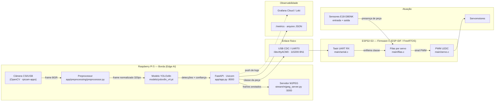

# Projeto V.I.T.A. - Visão Inteligente de Triagem Automática

> **Equipe Computação na Beirada:**
> - Dorian Dayvid Gomes Feitosa
> - Esdras Rodrigues de Andrade
> - Manuela Menezes Alves
> - Raphael Sousa Rabelo Rates

---

## Sumário
1. [Visão Geral](#1-visão-geral)
2. [Diagrama de Arquitetura](#2-diagrama-de-arquitetura)
3. [Esquemático elétrico](#3-esquemático-elétrico)
4. [Tabela de pinagem](#4-tabela-de-pinagem)
5. [Componentes da Solução](#5-componentes-da-solução)
6. [Estrutura das Pastas](#6-estrutura-das-pastas)

---

# PARTE 1: EXPLICAÇÃO DA SOLUÇÃO

## 1. Visão Geral

### O Problema

Em uma planta de manufatura avançada, peças recém-usinadas ou impressas em 3D trafegam **completamente misturadas** por uma esteira principal. Elas se acumulam durante o trajeto, gerando sobreposições esporádicas e posições aleatórias. Essa desordem inviabiliza a triagem eficiente e a alimentação padronizada das estações de montagem seguintes, criando gargalos e atrasando o ritmo de produção.

### A Solução

O **Projeto V.I.T.A.** é uma solução embarcada para identificação, monitoramento e triagem automática de componentes em uma linha de produção.

A arquitetura utiliza uma câmera conectada a uma **Raspberry Pi 5** para captura contínua de imagem. Uma API de inferência em Python (`yolo-api`) baseada em **YOLOv8** processa os frames e classifica as peças em tempo real. Os resultados são transmitidos via porta serial USB para um microcontrolador **ESP32-S3**, que gerencia filas de prioridade e aciona servomotores para o desvio das peças. O sistema também disponibiliza um servidor de streaming MJPEG para visualização web em tempo real.

---

## 2. Diagrama de Arquitetura



### Fluxo de um ciclo completo

**(TBD)**

---

## 3. Esquemático elétrico

**(TBD)**

---

## 4. Tabela de pinagem

**(TBD)**

---

## 5. Componentes da Solução

### Hardware
| Componente | Função na arquitetura |
|---|---|
| Câmera | Sensor óptico de entrada para captura de quadros da esteira. |
| Raspberry Pi 5 | Unidade central de processamento em borda (Edge AI), hospedagem da API e servidor de streaming.|
| ESP32-S3 | Microcontrolador de tempo real executando firmware determinístico em C (ESP-IDF/FreeRTOS). |
| Servomotores | Atuadores mecânicos responsáveis pelo desvio físico dos componentes. |

### Software
| Camada | Tecnologia | Versão | Função |
|---|---|---|---|
| Modelo de IA | yolo-epi (Ultralytics) | 8.2.0 | Detecção e classificação das peças em tempo real |
| API de inferência | FastAPI + Uvicorn | 0.111.0 / 0.29.0 | Expõe `/predict`, `/predict/image`, `/predict/batch`, `/health`, `/metrics` |
| Streaming | Flask | 3.1.3 | Servidor MJPEG com detecções sobrepostas (`stream/mjpeg_server.py`) |
| Pré-processamento | OpenCV + Pillow + NumPy | 4.9.0.80 / 11.0.0 / 1.26.4 | Letterbox, resize e filtros de imagem antes da inferência |
| Comunicação IoT | pyserial | 3.5.0 | Envio da classe detectada ao ESP32-S3 via USB serial |
| Firmware embarcado | ESP-IDF / FreeRTOS (C) | -- | Lógica de filas por servo e acionamento via LEDC/GPIO |
| Versionamento de modelo | DVC | -- | Rastreamento do arquivo `yolov8n.pt` fora do Git |
| Orquestração | Docker Compose | -- | Sobe os serviços `yolo-api`, `yolo-stream` e `yolo-client` |
---

## 6. Estrutura das Pastas

```
Projeto-Beirada/
├── README.md
├── LICENSE
├── docker-compose.yml          # Orquestra os 3 serviços
├── .dvc/config                 # Remote do DVC (ver Passo 4)
├── .github/workflows/
│   └── beirada_deploy.yml      # CI/CD
│
├── docs/
│   ├── esquematicos/           # Arquivos-fonte (.fzz / .kicad_sch)
│   └── imagens/                # Imagens e gifs do README
│
├── beirada_esp/                # ── FIRMWARE (ESP32-S3) ──
│   └── ledc_basic/
│       ├── CMakeLists.txt
│       └── main/
│           ├── ledc_basic_example_main.c   # app_main: inicializa servos, filas, serial
│           ├── servo.c / servo.h           # Pinagem, PWM LEDC, leitura de sensores
│           ├── filas.c / filas.h           # Uma fila + uma task FreeRTOS por servo
│           └── serial.c / serial.h         # Task UART: lê a classe vinda do RPi
│
└── beirada_ia/                 # ── VISÃO COMPUTACIONAL (RPi 5) ──
    ├── Dockerfile.api
    ├── Dockerfile.client
    ├── ruff.toml
    ├── app/
    │   ├── app.py              # Aplicação FastAPI e todos os endpoints
    │   ├── model.py            # Carregamento e cache do modelo YOLO
    │   ├── schemas.py          # Contratos Pydantic de entrada/saída
    │   ├── requirements.txt
    │   ├── .env.grafana        # Credenciais do Grafana Cloud (preencher)
    │   ├── core/               # Instâncias singleton (app, preprocessor, templates)
    │   ├── preprocessing/
    │   │   ├── preprocessor.py # Pipeline configurável de pré-processamento
    │   │   ├── utils/          # letterbox e utilitários
    │   │   └── experiments/    # Iterações de teste - fora do fluxo de produção
    │   ├── static/ · templates/# Interface web de visualização
    │   └── output/             # Métricas persistidas
    ├── client/
    │   └── client.py           # Cliente de teste: envia imagens à API
    ├── dataset/                # Dataset e script de treino
    ├── models/                 # Pesos versionados via DVC (.pt.dvc)
    ├── scripts/
    │   ├── deploy.sh
    │   ├── inspect_dataset.py
    │   └── validate_model.py
    ├── stream/
    │   ├── mjpeg_server.py     # Servidor MJPEG de produção
    │   ├── v3_optimized.py     # Cmera + detector otimizados (em uso)
    │   ├── v1_naive.py / v2_threaded.py   # Iterações anteriores - documentação
    │   └── raw_server.py / captire_frames.py
    └── tests/
        ├── test_api.py
        └── test_preprocessor.py
```

---

# PARTE 2: MANUAL DE REPLICAÇÃO

## Pré-requisitos

### Hardware que você precisa ter em mãos

- [ ] Raspberry Pi 5 com fonte oficial de 27 W
- [ ] Cartão microSD
- [ ] Câmera Raspberry CSI **ou** webcam USB compatível com V4L2
- [ ] Placa de desenvolvimento ESP32-S3
- [ ] Cabo USB-C de dados (atenção: cabos "só carga" não funcionam)
- [ ] 3 servomotores (SG90, MG90S ou equivalente)
- [ ] 6 sensores ópticos E18-D80NK
- [ ] 2 protoboards + jumpers macho-macho e macho-fêmea
- [ ] Fonte externa 5 V com no mínimo 3 A
- [ ] Esteira transportadora com velocidade constante
- [ ] Peças de teste entre 10 e 15 cm na maior dimensão

### Software no Raspberry Pi

| Ferramenta | Versão mínima | Função |
|---|---|---|
| Raspberry Pi OS (64-bit, Bookworm) | — | Sistema operacional |
| Docker Engine | 24.x | Executar os serviços |
| Docker Compose | v2 | Orquestração |
| Git | 2.x | Clonar o repositório |
| DVC | 3.x | Baixar os pesos do modelo |

### Software na máquina de desenvolvimento (para o firmware)

| Ferramenta | Versão | Função |
|---|---|---|
| ESP-IDF | ≥ 5.0 | Compilar e gravar o firmware |
| Python | 3.8+ | Requisito do ESP-IDF |

> O ESP-IDF pode ser instalado no próprio Raspberry Pi, mas a compilação é consideravelmente mais lenta. Recomendamos compilar em um PC e gravar via USB.

---

## Passo 1: Montagem física do hardware

**(IMAGEM: foto da montagem real completa, vista de cima, com os componentes identificados por etiquetas numeradas.)**

### 1.1 Preparar os barramentos de energia

1. Na **protoboard 1**, conecte a fonte externa de 5 V aos trilhos de alimentação. Esta protoboard alimenta os servomotores.
2. Na **protoboard 2**, faça o mesmo para os sensores.
3. **Interligue o trilho GND das duas protoboards ao GND do ESP32-S3.** Sem esse terra comum nada funciona corretamente.

### 1.2 Conectar os servomotores

Para cada servo, siga a tabela de pinagem da [seção 4](#4-tabela-de-pinagem):

- Fio **vermelho** → trilho 5 V da protoboard 1
- Fio **marrom/preto** → trilho GND
- Fio **laranja/amarelo** → GPIO correspondente do ESP32-S3

### 1.3 Posicionar servos e sensores na esteira

**(IMAGEM: foto em vista superior com as cotas anotadas: a distância e o ângulo marcados com setas e medidas sobre a imagem.)**

| Elemento | Posicionamento |
|---|---|
| Servomotor | A aproximadamente **X cm** da esteira de destino, no lado **oposto** ao desvio, de modo que o braço empurre a peça para fora da esteira principal |
| Sensor de entrada | Logo **antes** do servo, inclinado a **Y°** em relação à esteira, no mesmo sentido de movimento, de forma a acompanhar a peça até que seja desviada |
| Sensor de saída | Na **esteira perpendicular**, posicionado para detectar a peça já transferida |

### 1.4 Conectar os sensores

Cada E18-D80NK tem três fios:

- **Marrom** → 5 V (protoboard 2)
- **Azul** → GND
- **Preto** (sinal OUT) → GPIO do ESP32-S3, conforme a tabela de pinagem

---

## Passo 2: Preparação do Raspberry Pi 5

### 2.1 Sistema operacional

Grave o **Raspberry Pi OS 64-bit (Bookworm)** no cartão microSD usando o Raspberry Pi Imager e faça o primeiro boot.

### 2.2 Habilitar e testar a câmera

```bash
# Para câmera CSI - deve abrir uma prévia por 5 segundos
rpicam-hello --timeout 5000

# Para webcam USB - deve listar /dev/video0
v4l2-ctl --list-devices
```

### 2.3 Instalar Docker e Docker Compose

```bash
curl -fsSL https://get.docker.com | sudo sh
sudo usermod -aG docker $USER
```

Faça **logout e login novamente** para que a mudança de grupo tenha efeito.

### 2.4 Instalar Git e DVC

```bash
sudo apt update && sudo apt install -y git python3-pip
pip install dvc --break-system-packages
```

### 2.5 Liberar acesso à porta serial

```bash
sudo usermod -aG dialout $USER
```

Novamente, é preciso relogar.

---

## Passo 3: Compilação e gravação do firmware ESP32-S3

### 3.1 Instalar o ESP-IDF

```bash
mkdir -p ~/esp && cd ~/esp
git clone -b v5.2 --recursive https://github.com/espressif/esp-idf.git
cd esp-idf && ./install.sh esp32s3
. ./export.sh          
```

### 3.2 Revisar a pinagem antes de compilar

Abra `beirada_esp/ledc_basic/main/servo.h` e confirme que os GPIOs correspondem à sua montagem física (ver [seção 4](#4-tabela-de-pinagem)).

### 3.3 Compilar e gravar

```bash
cd beirada_esp/ledc_basic

idf.py set-target esp32s3
idf.py build
idf.py -p /dev/ttyACM0 flash monitor
```

Substitua `/dev/ttyACM0` pela porta do seu sistema (no Linux costuma ser `/dev/ttyUSB0` ou `/dev/ttyACM0`; no Windows, `COM3` etc.).

---

## Passo 4: Configuração do sistema

### 4.1 Clonar o repositório

```bash
git clone <url-do-repositorio>
cd Projeto-Beirada
```

### 4.2 Obter os pesos do modelo

**Opção A: usar um modelo já versionado no repositório**

Os pesos `yolov8n.pt` e `yolov8n_v3.pt` estão presentes em `beirada_ia/models/`. Para usá-los, ajuste as variáveis no `docker-compose.yml`:

```yaml
- MODEL_NAME=yolov8n_v3.pt
- MODEL_PATH=/app/models/yolov8n_v3.pt
```

**Opção B: configurar um remote próprio e puxar o `v4`**

```bash
dvc remote add -d meu_remote /caminho/para/armazenamento
dvc pull beirada_ia/models/yolov8n_v4.pt.dvc
```

**Opção C: treinar seu próprio modelo** com o script em `beirada_ia/dataset/`, gerando um `.pt` com as suas 3–4 classes de peça.

### 4.3 Variáveis de ambiente

Todas ficam no `docker-compose.yml`, no serviço `yolo-api`:

| Variável | Padrão | O que faz |
|---|---|---|
| `MODEL_NAME` | `yolov8n_v4.pt` | Nome do arquivo de pesos |
| `MODEL_PATH` | `/app/models/yolov8n_v4.pt` | Caminho dentro do contêiner |
| `CONFIDENCE` | `0.70` | Confiança mínima para aceitar uma detecção |
| `ESP32_SERIAL_PORT` | `/dev/ttyACM0` | Porta serial do ESP32 |
| `ESP32_SERIAL_BAUD` | `115200` | Deve casar com o firmware |
| `ESP32_MIN_INTERVAL_S` | `0.1` | Intervalo mínimo entre comandos |
| `ESP32_SERIAL_ENABLED` | `true` | Liga/desliga o enlace serial |

### 4.4 Ajustar a porta serial se necessário

Confirme qual dispositivo o ESP32 assumiu:

```bash
ls -l /dev/ttyACM* /dev/ttyUSB* 2>/dev/null
```

Se for diferente de `/dev/ttyACM0`, ajuste **os dois lugares** no `docker-compose.yml`: a variável `ESP32_SERIAL_PORT` e o mapeamento em `devices:`.

### 4.5 Grafana Cloud (opcional)

Para habilitar o envio de logs, preencha `beirada_ia/app/.env.grafana`:

```bash
GRAFANA_CLOUD_ENDPOINT="https://logs-prod-<REGIAO>.grafana.net/loki/api/v1/push"
GRAFANA_CLOUD_USERNAME="<seu-user-id>"
GRAFANA_CLOUD_TOKEN="<seu-token>"
```

Depois, carregue o arquivo no serviço adicionando ao `yolo-api` no `docker-compose.yml`:

```yaml
    env_file:
      - ./beirada_ia/app/.env.grafana
```

Sem essa configuração o sistema funciona normalmente - apenas não exporta logs para o dashboard.

---

## Passo 5: Execução

```bash
docker compose up --build
```

Na primeira execução o build leva vários minutos (compilação do OpenCV e do PyTorch para ARM). Execuções seguintes usam cache.

Para rodar em segundo plano:

```bash
docker compose up -d --build
docker compose logs -f yolo-api
```

Para parar:

```bash
docker compose down
```

### Serviços expostos

| Serviço | Endereço | Função |
|---|---|---|
| `yolo-api` | `http://<IP-DO-RPI>:8000` | API REST de inferência |
| `yolo-stream` | `http://<IP-DO-RPI>:5000/stream` | Stream MJPEG anotado |
| `yolo-client` | - | Roda inferências de teste automaticamente |

### Endpoints principais

| Método | Rota | Descrição |
|---|---|---|
| `GET` | `/health` | Estado do serviço e do modelo carregado |
| `POST` | `/predict` | Inferência sobre imagem em base64, retorna JSON |
| `POST` | `/predict/image` | Mesma inferência, retorna JPEG anotado |
| `POST` | `/predict/camera` | Captura da câmera e infere, retorna JSON |
| `GET` | `/predict/camera/image` | Captura da câmera e infere, retorna JPEG |
| `POST` | `/predict/batch` | Lote de imagens |
| `GET` | `/metrics` | Métricas acumuladas (total, sucesso, latência média) |
| `GET` | `/stream/camera` | Stream MJPEG direto da API |
| `GET` | `/stream/view` | Página HTML de visualização em tempo real |
| `GET` | `/docs` | Documentação interativa (Swagger) |

---

## Passo 6: Verificação do resultado

Esta é a seção que confirma que a replicação deu certo. Execute as verificações na ordem.

### 6.1 Os contêineres subiram

```bash
docker compose ps
```

**Esperado:** três serviços com `STATUS` em `Up`, e `yolo-api` marcado como `(healthy)`.

### 6.2 A API responde e o modelo carregou

```bash
curl http://localhost:8000/health
```

**Esperado:**

```json
{"status":"ok","model_loaded":true,"model_name":"yolov8n_v4.pt"}
```

Se `model_loaded` vier `false`, o caminho do modelo está errado; volte ao Passo 4.2.

### 6.3 A inferência funciona sobre uma imagem

```bash
curl -X POST http://localhost:8000/predict/camera \
     -H "Content-Type: application/json" -d '{}'
```

**Esperado:** JSON com um array `detections`, cada item contendo `label`, `confidence` e `bbox`, além de um campo de tempo de inferência.

### 6.4 O stream em tempo real funciona

Abra no navegador de outra máquina da mesma rede:

```
http://<IP-DO-RPI>:5000/stream
http://<IP-DO-RPI>:8000/stream/view
```

**(IMAGEM: página /stream/view com bounding boxes desenhadas sobre peças reais)**

**Esperado:** vídeo ao vivo da esteira com caixas delimitadoras e rótulos de classe sobre as peças.

### 6.5 O ESP32 recebe comandos e aciona os servos

Com o `idf.py monitor` aberto em um terminal:

```bash
echo "1" > /dev/ttyACM0
```

**Esperado no monitor:**

```
I (xxx) UART_COMUNICAO: Comando serial recebido: '1' -> Classe: 1
I (xxx) LOGICA_FILAS: Peça classe 1 enfileirada para aguardar no Sensor 1
I (xxx) LOGICA_FILAS: Servo 1 aguardando peça no Sensor de ENTRADA...
```

Agora passe a mão na frente do sensor de entrada 1:

```
I (xxx) LOGICA_FILAS: Peça na entrada do Servo 1! Acionando braço...
I (xxx) LOGICA_FILAS: Aguardando confirmação no Sensor de SAÍDA 1...
```

E na frente do sensor de saída 1:

```
I (xxx) LOGICA_FILAS: Peça recebida na esteira perpendicular 1! Recolhendo servo.
```

O servo deve abrir no primeiro evento e voltar a 90° no segundo.

### 6.6 Teste ponta a ponta

**(IMAGEM: gif do ciclo completo - peça na esteira, detecção na tela, servo desviando)**

Coloque uma peça na esteira em movimento e acompanhe:

1. A peça aparece no stream com bounding box e rótulo correto.
2. O sensor de entrada correspondente acusa a passagem no log do firmware.
3. O servo aciona e desvia a peça.
4. O sensor de saída confirma e o servo recolhe.

### 6.7 Suíte de testes automatizados

```bash
docker compose exec yolo-api python -m pytest tests/ -v
```

**Esperado:** todos os testes de `test_api.py` e `test_preprocessor.py` passando.

---

## Passo 7: Calibração e ajustes

### 7.1 Limiar de confiança

Controlado por `CONFIDENCE` no `docker-compose.yml`:

- **Valor alto (0,80+):** menos falsos positivos, mas peças podem passar sem ser classificadas.
- **Valor baixo (0,50):** captura mais peças, ao custo de classificações erradas.
- **Recomendado:** comece em 0,70, observe o stream por alguns minutos e ajuste.

### 7.2 Ângulos dos servos

Definidos em `servo.c`, função `servo_abrir()`:

```c
void servo_abrir(servo_id_t id)
{
    if (id == servo2) {
        servo_angulo(id, 50);    // servo 2 é espelhado (lado oposto da esteira)
    } else {
        servo_angulo(id, 150);
    }
}
```

Ajuste esses valores conforme a geometria da sua esteira. A posição de repouso (90°, em `servo_desativar()`) deve deixar o braço paralelo à esteira, sem obstruir a passagem.

### 7.3 Desempenho do streaming

No comando do serviço `yolo-stream` no `docker-compose.yml`:

| Parâmetro | Padrão | Efeito |
|---|---|---|
| `--infer-size` | 300 | Resolução de inferência. Menor - mais rápido, menos preciso |
| `--infer-every` | 3 | Infere a cada N frames. Maior - menos carga, mais latência de reação |
| `--device` | 0 | Índice da câmera |

---

## Licença

Distribuído sob os termos do arquivo [LICENSE](LICENSE).

---

<p align="center">
  <sub>Projeto V.I.T.A. · Computação na Beirada · 2026</sub>
</p>


