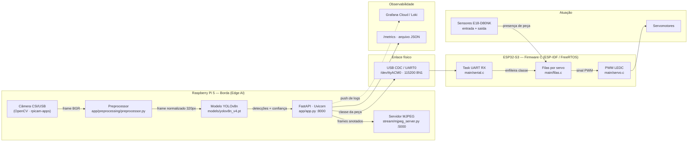

# Projeto V.I.T.A. - Visão Inteligente de Triagem Automática

> **Equipe Computação na Beirada:**
> - Dorian Dayvid Gomes Feitosa
> - Esdras Rodrigues de Andrade
> - Manuela Menezes Alves
> - Raphael Sousa Rabelo Rates

---

## Sumário
1. [Visão Geral](#visão-geral)
2. [Diagrama de Arquitetura](#diagrama-de-arquitetura)
3. [Esquemático elétrico](#esquemático-elétrico)
4. [Tabela de pinagem](#tabela-de-pinagem)
5. [Componentes da Solução](#componentes-da-solução)
6. [Estrutura das Pastas](#estrutura-das-pastas)
7. [Pré-requisitos](#pré-requisitos)
8. [Instruções de Configuração (Setup)](#instruções-de-configuração-setup)

---

# PARTE 1: EXPLICAÇÃO DA SOLUÇÃO

## 1. Visão Geral

### O Problema

Em uma planta de manufatura avançada, peças recém-usinadas ou impressas em 3D trafegam **completamente misturadas** por uma esteira principal. Elas se acumulam durante o trajeto, gerando sobreposições esporádicas e posições aleatórias. Essa desordem inviabiliza a triagem eficiente e a alimentação padronizada das estações de montagem seguintes, criando gargalos e atrasando o ritmo de produção.

### A Solução

O **Projeto V.I.T.A.** é uma solução embarcada para identificação, monitoramento e triagem automática de componentes em uma linha de produção.

A arquitetura utiliza uma câmera conectada a uma **Raspberry Pi 5** para captura contínua de imagem. Uma API de inferência em Python (`yolo-api`) baseada em **YOLOv8** processa os frames e classifica as peças em tempo real. Os resultados são transmitidos via porta serial USB para um microcontrolador **ESP32-S3**, que gerencia filas de prioridade e aciona servomotores para o desvio das peças. O sistema também disponibiliza um servidor de streaming MJPEG para visualização web em tempo real.

---

## 2. Diagrama de Arquitetura



### Fluxo de um ciclo completo

**(TBD)**

---

## 3. Esquemático elétrico

**(TBD)**

---

## 4. Tabela de pinagem

**(TBD)**

---

## 5. Componentes da Solução

### Hardware
| Componente | Função na arquitetura |
|---|---|
| Câmera | Sensor óptico de entrada para captura de quadros da esteira. |
| Raspberry Pi 5 | Unidade central de processamento em borda (Edge AI), hospedagem da API e servidor de streaming.|
| ESP32-S3 | Microcontrolador de tempo real executando firmware determinístico em C (ESP-IDF/FreeRTOS). |
| Servomotores | Atuadores mecânicos responsáveis pelo desvio físico dos componentes. |

### Software
| Camada | Tecnologia | Versão | Função |
|---|---|---|---|
| Modelo de IA | yolo-epi (Ultralytics) | 8.2.0 | Detecção e classificação das peças em tempo real |
| API de inferência | FastAPI + Uvicorn | 0.111.0 / 0.29.0 | Expõe `/predict`, `/predict/image`, `/predict/batch`, `/health`, `/metrics` |
| Streaming | Flask | 3.1.3 | Servidor MJPEG com detecções sobrepostas (`stream/mjpeg_server.py`) |
| Pré-processamento | OpenCV + Pillow + NumPy | 4.9.0.80 / 11.0.0 / 1.26.4 | Letterbox, resize e filtros de imagem antes da inferência |
| Comunicação IoT | pyserial | 3.5.0 | Envio da classe detectada ao ESP32-S3 via USB serial |
| Firmware embarcado | ESP-IDF / FreeRTOS (C) | -- | Lógica de filas por servo e acionamento via LEDC/GPIO |
| Versionamento de modelo | DVC | -- | Rastreamento do arquivo `yolov8n.pt` fora do Git |
| Orquestração | Docker Compose | -- | Sobe os serviços `yolo-api`, `yolo-stream` e `yolo-client` |
---

## 6. Estrutura das Pastas

```
Projeto-Beirada/
├── README.md
├── LICENSE
├── docker-compose.yml          # Orquestra os 3 serviços
├── .dvc/config                 # Remote do DVC (ver Passo 4)
├── .github/workflows/
│   └── beirada_deploy.yml      # CI/CD
│
├── docs/
│   ├── esquematicos/           # Arquivos-fonte (.fzz / .kicad_sch)
│   └── imagens/                # Imagens e gifs do README
│
├── beirada_esp/                # ── FIRMWARE (ESP32-S3) ──
│   └── ledc_basic/
│       ├── CMakeLists.txt
│       └── main/
│           ├── ledc_basic_example_main.c   # app_main: inicializa servos, filas, serial
│           ├── servo.c / servo.h           # Pinagem, PWM LEDC, leitura de sensores
│           ├── filas.c / filas.h           # Uma fila + uma task FreeRTOS por servo
│           └── serial.c / serial.h         # Task UART: lê a classe vinda do RPi
│
└── beirada_ia/                 # ── VISÃO COMPUTACIONAL (RPi 5) ──
    ├── Dockerfile.api
    ├── Dockerfile.client
    ├── ruff.toml
    ├── app/
    │   ├── app.py              # Aplicação FastAPI e todos os endpoints
    │   ├── model.py            # Carregamento e cache do modelo YOLO
    │   ├── schemas.py          # Contratos Pydantic de entrada/saída
    │   ├── requirements.txt
    │   ├── .env.grafana        # Credenciais do Grafana Cloud (preencher)
    │   ├── core/               # Instâncias singleton (app, preprocessor, templates)
    │   ├── preprocessing/
    │   │   ├── preprocessor.py # Pipeline configurável de pré-processamento
    │   │   ├── utils/          # letterbox e utilitários
    │   │   └── experiments/    # Iterações de teste - fora do fluxo de produção
    │   ├── static/ · templates/# Interface web de visualização
    │   └── output/             # Métricas persistidas
    ├── client/
    │   └── client.py           # Cliente de teste: envia imagens à API
    ├── dataset/                # Dataset e script de treino
    ├── models/                 # Pesos versionados via DVC (.pt.dvc)
    ├── scripts/
    │   ├── deploy.sh
    │   ├── inspect_dataset.py
    │   └── validate_model.py
    ├── stream/
    │   ├── mjpeg_server.py     # Servidor MJPEG de produção
    │   ├── v3_optimized.py     # Cmera + detector otimizados (em uso)
    │   ├── v1_naive.py / v2_threaded.py   # Iterações anteriores - documentação
    │   └── raw_server.py / captire_frames.py
    └── tests/
        ├── test_api.py
        └── test_preprocessor.py
```

---

# PARTE 2: MANUAL DE REPLICAÇÃO

---

## Instruções de Configuração (Setup)

A configuração do sistema é dividida em duas etapas principais: preparação do ambiente de visão computacional no Raspberry Pi e configuração do firmware responsável pelo controle dos atuadores no ESP32-S3.

### 1. API de visão computacional + streaming (Raspberry Pi)

```bash
# 1. Clonar o repositório
git clone <url-do-repositorio>
cd Projeto-Beirada

# 2. Recuperar o modelo yolo-epi versionado via DVC
dvc pull beirada_ia/models/yolov8n.pt.dvc

# 3. Subir os serviços (API, stream e cliente de teste)
docker compose up --build
```
Antes de iniciar os serviços, é necessário garantir que o Raspberry Pi possui Docker, Docker Compose e DVC instalados e configurados.

Também é necessário conectar a câmera ao Raspberry Pi e verificar se ela está disponível para o serviço de streaming.

O `docker-compose.yml` inicia:
- **yolo-api** -- `http://localhost:8000` (rotas `/predict`, `/health`, `/metrics`, `/stream/camera`)
- **yolo-stream** -- `http://localhost:5000` (stream MJPEG anotado)
- **yolo-client** -- executa automaticamente inferências de teste com as imagens em `beirada_ia/client/images/`

> A API espera acesso ao dispositivo serial `/dev/ttyACM0` (configurável via variável de ambiente `ESP32_SERIAL_PORT`) para se comunicar com o ESP32-S3.

### 2. Firmware do ESP32-S3 (controle dos servomotores)

```bash
cd beirada_esp/ledc_basic

# Configurar e compilar com o ESP-IDF
idf.py set-target esp32s3
idf.py build

# Gravar no dispositivo e acompanhar o log serial
idf.py -p <PORTA_SERIAL> flash monitor
```

> **Nota:** os experimentos em `beirada_ia/app/preprocessing/experiments/` e as versões `v1_naive.py` / `v2_threaded.py` do streaming documentam as iterações de otimização já testadas pela equipe, mas não fazem parte do fluxo de produção (`mjpeg_server.py` + `v3_optimized.py`).

### 3. Montagem física (servomotores + sensor infravermelho E18-D80NK)

- Posicionar servomotor aproximadamente 20cm da esteira alvo do objeto, do lado oposto.

- Posicionar sensor E18-D80NK logo antes do servo motor, inclinado a 45° da esteira, no mesmo sentido de funcionamento da mesma, de forma que acompanhe a peça até que ela seja movida para a esteira paralela.
