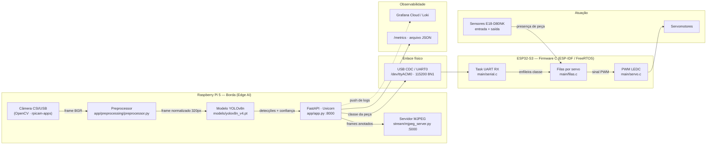

# Projeto V.I.T.A. - Visão Inteligente de Triagem Automática

> **Equipe Computação na Beirada:**
> - Dorian Dayvid Gomes Feitosa
> - Esdras Rodrigues de Andrade
> - Manuela Menezes Alves
> - Raphael Sousa Rabelo Rates

---

## Sumário
1. [Visão Geral](#1-visão-geral)
2. [Diagrama de Arquitetura](#2-diagrama-de-arquitetura)
3. [Esquemático elétrico](#3-esquemático-elétrico)
4. [Tabela de pinagem](#4-tabela-de-pinagem)
5. [Componentes da Solução](#5-componentes-da-solução)
6. [Estrutura das Pastas](#6-estrutura-das-pastas)

---

# PARTE 1: EXPLICAÇÃO DA SOLUÇÃO

## 1. Visão Geral

### O Problema

Em uma planta de manufatura avançada, peças recém-usinadas ou impressas em 3D trafegam **completamente misturadas** por uma esteira principal. Elas se acumulam durante o trajeto, gerando sobreposições esporádicas e posições aleatórias. Essa desordem inviabiliza a triagem eficiente e a alimentação padronizada das estações de montagem seguintes, criando gargalos e atrasando o ritmo de produção.

### A Solução

O **Projeto V.I.T.A.** é uma solução embarcada para identificação, monitoramento e triagem automática de componentes em uma linha de produção.

A arquitetura utiliza uma câmera conectada a uma **Raspberry Pi 5** para captura contínua de imagem. Uma API de inferência em Python (`yolo-api`) baseada em **YOLOv8** processa os frames e classifica as peças em tempo real. Os resultados são transmitidos via porta serial USB para um microcontrolador **ESP32-S3**, que gerencia filas de prioridade e aciona servomotores para o desvio das peças. O sistema também disponibiliza um servidor de streaming MJPEG para visualização web em tempo real.

---

## 2. Diagrama de Arquitetura



### Fluxo de um ciclo completo

**(TBD)**

---

## 3. Esquemático elétrico

**(TBD)**

---

## 4. Tabela de pinagem

**(TBD)**

---

## 5. Componentes da Solução

### Hardware
| Componente | Função na arquitetura |
|---|---|
| Câmera | Sensor óptico de entrada para captura de quadros da esteira. |
| Raspberry Pi 5 | Unidade central de processamento em borda (Edge AI), hospedagem da API e servidor de streaming.|
| ESP32-S3 | Microcontrolador de tempo real executando firmware determinístico em C (ESP-IDF/FreeRTOS). |
| Servomotores | Atuadores mecânicos responsáveis pelo desvio físico dos componentes. |

### Software
| Camada | Tecnologia | Versão | Função |
|---|---|---|---|
| Modelo de IA | yolo-epi (Ultralytics) | 8.2.0 | Detecção e classificação das peças em tempo real |
| API de inferência | FastAPI + Uvicorn | 0.111.0 / 0.29.0 | Expõe `/predict`, `/predict/image`, `/predict/batch`, `/health`, `/metrics` |
| Streaming | Flask | 3.1.3 | Servidor MJPEG com detecções sobrepostas (`stream/mjpeg_server.py`) |
| Pré-processamento | OpenCV + Pillow + NumPy | 4.9.0.80 / 11.0.0 / 1.26.4 | Letterbox, resize e filtros de imagem antes da inferência |
| Comunicação IoT | pyserial | 3.5.0 | Envio da classe detectada ao ESP32-S3 via USB serial |
| Firmware embarcado | ESP-IDF / FreeRTOS (C) | -- | Lógica de filas por servo e acionamento via LEDC/GPIO |
| Versionamento de modelo | DVC | -- | Rastreamento do arquivo `yolov8n.pt` fora do Git |
| Orquestração | Docker Compose | -- | Sobe os serviços `yolo-api`, `yolo-stream` e `yolo-client` |
---

## 6. Estrutura das Pastas

```
Projeto-Beirada/
├── README.md
├── LICENSE
├── docker-compose.yml          # Orquestra os 3 serviços
├── .dvc/config                 # Remote do DVC (ver Passo 4)
├── .github/workflows/
│   └── beirada_deploy.yml      # CI/CD
│
├── docs/
│   ├── esquematicos/           # Arquivos-fonte (.fzz / .kicad_sch)
│   └── imagens/                # Imagens e gifs do README
│
├── beirada_esp/                # ── FIRMWARE (ESP32-S3) ──
│   └── ledc_basic/
│       ├── CMakeLists.txt
│       └── main/
│           ├── ledc_basic_example_main.c   # app_main: inicializa servos, filas, serial
│           ├── servo.c / servo.h           # Pinagem, PWM LEDC, leitura de sensores
│           ├── filas.c / filas.h           # Uma fila + uma task FreeRTOS por servo
│           └── serial.c / serial.h         # Task UART: lê a classe vinda do RPi
│
└── beirada_ia/                 # ── VISÃO COMPUTACIONAL (RPi 5) ──
    ├── Dockerfile.api
    ├── Dockerfile.client
    ├── ruff.toml
    ├── app/
    │   ├── app.py              # Aplicação FastAPI e todos os endpoints
    │   ├── model.py            # Carregamento e cache do modelo YOLO
    │   ├── schemas.py          # Contratos Pydantic de entrada/saída
    │   ├── requirements.txt
    │   ├── .env.grafana        # Credenciais do Grafana Cloud (preencher)
    │   ├── core/               # Instâncias singleton (app, preprocessor, templates)
    │   ├── preprocessing/
    │   │   ├── preprocessor.py # Pipeline configurável de pré-processamento
    │   │   ├── utils/          # letterbox e utilitários
    │   │   └── experiments/    # Iterações de teste - fora do fluxo de produção
    │   ├── static/ · templates/# Interface web de visualização
    │   └── output/             # Métricas persistidas
    ├── client/
    │   └── client.py           # Cliente de teste: envia imagens à API
    ├── dataset/                # Dataset e script de treino
    ├── models/                 # Pesos versionados via DVC (.pt.dvc)
    ├── scripts/
    │   ├── deploy.sh
    │   ├── inspect_dataset.py
    │   └── validate_model.py
    ├── stream/
    │   ├── mjpeg_server.py     # Servidor MJPEG de produção
    │   ├── v3_optimized.py     # Cmera + detector otimizados (em uso)
    │   ├── v1_naive.py / v2_threaded.py   # Iterações anteriores - documentação
    │   └── raw_server.py / captire_frames.py
    └── tests/
        ├── test_api.py
        └── test_preprocessor.py
```

---

# PARTE 2: MANUAL DE REPLICAÇÃO

## Pré-requisitos

### Hardware que você precisa ter em mãos

- [ ] Raspberry Pi 5 com fonte oficial de 27 W
- [ ] Cartão microSD
- [ ] Câmera Raspberry CSI **ou** webcam USB compatível com V4L2
- [ ] Placa de desenvolvimento ESP32-S3
- [ ] Cabo USB-C de dados (atenção: cabos "só carga" não funcionam)
- [ ] 3 servomotores (SG90, MG90S ou equivalente)
- [ ] 6 sensores ópticos E18-D80NK
- [ ] 2 protoboards + jumpers macho-macho e macho-fêmea
- [ ] Fonte externa 5 V com no mínimo 3 A
- [ ] Esteira transportadora com velocidade constante
- [ ] Peças de teste entre 10 e 15 cm na maior dimensão

### Software no Raspberry Pi

| Ferramenta | Versão mínima | Função |
|---|---|---|
| Raspberry Pi OS (64-bit, Bookworm) | — | Sistema operacional |
| Docker Engine | 24.x | Executar os serviços |
| Docker Compose | v2 | Orquestração |
| Git | 2.x | Clonar o repositório |
| DVC | 3.x | Baixar os pesos do modelo |

### Software na máquina de desenvolvimento (para o firmware)

| Ferramenta | Versão | Função |
|---|---|---|
| ESP-IDF | ≥ 5.0 | Compilar e gravar o firmware |
| Python | 3.8+ | Requisito do ESP-IDF |

> O ESP-IDF pode ser instalado no próprio Raspberry Pi, mas a compilação é consideravelmente mais lenta. Recomendamos compilar em um PC e gravar via USB.

---

## Passo 1: Montagem física do hardware

**(IMAGEM: foto da montagem real completa, vista de cima, com os componentes identificados por etiquetas numeradas.)**

### 1.1 Preparar os barramentos de energia

1. Na **protoboard 1**, conecte a fonte externa de 5 V aos trilhos de alimentação. Esta protoboard alimenta os servomotores.
2. Na **protoboard 2**, faça o mesmo para os sensores.
3. **Interligue o trilho GND das duas protoboards ao GND do ESP32-S3.** Sem esse terra comum nada funciona corretamente.

### 1.2 Conectar os servomotores

Para cada servo, siga a tabela de pinagem da [seção 4](#4-tabela-de-pinagem):

- Fio **vermelho** → trilho 5 V da protoboard 1
- Fio **marrom/preto** → trilho GND
- Fio **laranja/amarelo** → GPIO correspondente do ESP32-S3

### 1.3 Posicionar servos e sensores na esteira

**(IMAGEM: foto em vista superior com as cotas anotadas: a distância e o ângulo marcados com setas e medidas sobre a imagem.)**

| Elemento | Posicionamento |
|---|---|
| Servomotor | A aproximadamente **X cm** da esteira de destino, no lado **oposto** ao desvio, de modo que o braço empurre a peça para fora da esteira principal |
| Sensor de entrada | Logo **antes** do servo, inclinado a **Y°** em relação à esteira, no mesmo sentido de movimento, de forma a acompanhar a peça até que seja desviada |
| Sensor de saída | Na **esteira perpendicular**, posicionado para detectar a peça já transferida |

### 1.4 Conectar os sensores

Cada E18-D80NK tem três fios:

- **Marrom** → 5 V (protoboard 2)
- **Azul** → GND
- **Preto** (sinal OUT) → GPIO do ESP32-S3, conforme a tabela de pinagem


