# Projeto V.I.T.A. - Visão Inteligente de Triagem Automática

> **Equipe Computação na Beirada:**
> - Dorian Dayvid Gomes Feitosa
> - Esdras Rodrigues de Andrade
> - Manuela Menezes Alves
> - Raphael Sousa Rabelo Rates

---

## Sumário
1. [Visão Geral](#visão-geral)
2. [Diagrama de Arquitetura](#diagrama-de-arquitetura)
3. [Componentes da Solução](#componentes-da-solução)
4. [Dependências](#dependências)
5. [Estrutura das Pastas](#estrutura-das-pastas)
6. [Pré-requisitos](#pré-requisitos)
7. [Instruções de Configuração (Setup)](#instruções-de-configuração-setup)

---

## Visão Geral

O **Projeto V.I.T.A.** é uma solução embarcada para identificação, monitoramento e triagem automática de componentes em uma linha de produção.

A arquitetura utiliza uma câmera conectada a uma **Raspberry Pi 5** para captura contínua de imagem. Uma API de inferência em Python (`yolo-api`) baseada em **YOLOv8** processa os frames e classifica as peças em tempo real. Os resultados são transmitidos via porta serial USB para um microcontrolador **ESP32-S3**, que gerencia filas de prioridade e aciona servomotores para o desvio das peças. O sistema também disponibiliza um servidor de streaming MJPEG para visualização web em tempo real.

---

## Diagrama de Arquitetura

O diagrama abaixo apresenta o fluxo integrado entre os componentes de **Visão Computacional (Edge AI)** e **IoT/Embarcados**:

```mermaid
flowchart LR
    subgraph RPI["Raspberry Pi 5 (Borda / Edge AI)"]
        CAM["Câmera CSI / USB<br>(rpicam-vid / OpenCV)"]
        PRE["Preprocessor<br>(beirada_ia/app/preprocessing/)"]
        YOLO["Modelo YOLOv8<br>(beirada_ia/models/yolov8n.pt.dvc)"]
        API["FastAPI / Uvicorn<br>(beirada_ia/app/app.py)"]
        STREAM["Servidor MJPEG<br>(beirada_ia/stream/mjpeg_server.py)"]
        SERIAL["Serviço Serial<br>(beirada_ia/app/services/serial_service.py)"]
    end

    subgraph CONECT["Conectividade & Docker"]
        USB["Porta Serial USB<br>/dev/ttyACM0 - 115200 baud"]
        DOCKER["Docker Compose<br>(docker-compose.yml)"]
    end

    subgraph ESP["ESP32-S3 (Firmware C / ESP-IDF)"]
        FILAS["Gerenciador de Filas<br>(beirada_esp/ledc_basic/main/filas.c)"]
        SERVOS["Controle PWM LEDC Servos<br>(beirada_esp/ledc_basic/main/servo.c)"]
    end

    CAM -->|Frame Bruto| PRE
    PRE -->|Frame Normalizado| YOLO
    YOLO -->|Detecções / Bounding Boxes| API
    API -->|Superposição de Labels| STREAM
    API -->|Classe Detectada| SERIAL
    SERIAL -->|String Protocolo ASCII| USB
    USB -->|Recebe Classe| FILAS
    FILAS -->|Sinal PWM / GPIO| SERVOS
```



---

## Componentes da Solução

### Hardware
| Componente | Função na arquitetura |
|---|---|
| Câmera | Sensor óptico de entrada para captura de quadros da esteira. |
| Raspberry Pi 5 | Unidade central de processamento em borda (Edge AI), hospedagem da API e servidor de streaming.|
| ESP32-S3 | Microcontrolador de tempo real executando firmware determinístico em C (ESP-IDF/FreeRTOS). |
| Servomotores | Atuadores mecânicos responsáveis pelo desvio físico dos componentes. |

### Software
| Camada | Tecnologia | Versão | Função |
|---|---|---|---|
| Modelo de IA | yolo-epi (Ultralytics) | 8.2.0 | Detecção e classificação das peças em tempo real |
| API de inferência | FastAPI + Uvicorn | 0.111.0 / 0.29.0 | Expõe `/predict`, `/predict/image`, `/predict/batch`, `/health`, `/metrics` |
| Streaming | Flask | 3.1.3 | Servidor MJPEG com detecções sobrepostas (`stream/mjpeg_server.py`) |
| Pré-processamento | OpenCV + Pillow + NumPy | 4.9.0.80 / 11.0.0 / 1.26.4 | Letterbox, resize e filtros de imagem antes da inferência |
| Comunicação IoT | pyserial | 3.5.0 | Envio da classe detectada ao ESP32-S3 via USB serial |
| Firmware embarcado | ESP-IDF / FreeRTOS (C) | -- | Lógica de filas por servo e acionamento via LEDC/GPIO |
| Versionamento de modelo | DVC | -- | Rastreamento do arquivo `yolov8n.pt` fora do Git |
| Orquestração | Docker Compose | -- | Sobe os serviços `yolo-api`, `yolo-stream` e `yolo-client` |
---

## Dependências

### Python - API e Streaming
```
fastapi==0.111.0
uvicorn[standard]==0.29.0
ultralytics==8.2.0
Pillow==11.0.0
numpy==1.26.4
httpx==0.27.0
opencv-python-headless==4.9.0.80
flask==3.1.3
pyserial==3.5.0
```

### Python - Cliente de teste
```
httpx==0.27.0
Pillow==10.3.0
```

### Firmware - ESP32-S3
- **ESP-IDF** (framework oficial Espressif)
- **FreeRTOS** (filas e tasks por servo; já incluso no ESP-IDF)
- Driver **LEDC** (controle de PWM/GPIO dos servomotores)

### Plataformas e ferramentas externas
- **Docker** e **Docker Compose** (orquestração dos serviços `yolo-api`, `yolo-stream`, `yolo-client`)
- **rpicam-apps** (`rpicam-vid`/`rpicam-still`) -- captura via câmera CSI na Raspberry Pi
- **DVC** -- versionamento do modelo `yolov8n.pt`
- Porta serial USB para comunicação com o ESP32-S3
  
---

## Estrutura das Pastas

```

Projeto-Beirada/
├── .gitignore
├── README.md
├── LICENSE
├── docker-compose.yml
├── .dvc/
│   └── config
├── .github/
│   └── workflows/
│       └── beirada_deploy.yml
├── beirada_esp/
│   └── ledc_basic/
│       ├── CMakeLists.txt
│       ├── README.md
│       └── main/
│           ├── CMakeLists.txt
│           ├── ledc_basic_example_main.c
│           ├── filas.c / filas.h
│           └── servo.c / servo.h
└── beirada_ia/
    ├── Dockerfile.api
    ├── Dockerfile.client
    ├── ruff.toml
    ├── app/
    │   ├── app.py
    │   ├── model.py
    │   ├── schemas.py
    │   ├── requirements.txt
    │   ├── core/
    │   ├── preprocessing/
    │   │   ├── preprocessor.py
    │   │   ├── experiments/
    │   │   └── utils/
    │   ├── services/
    │   │   ├── capture_image_service.py
    │   │   ├── inference_service.py
    │   │   ├── log_service.py
    │   │   └── serial_service.py
    │   ├── static/
    │   └── templates/
    ├── client/
    │   ├── client.py
    │   └── requirements.txt
    ├── dataset/
    │   └── beirada.v1-v1/
    │       └── train.py
    ├── models/
    │   └── yolov8n.pt.dvc
    ├── scripts/
    │   ├── deploy.sh
    │   ├── inspect_dataset.py
    │   └── validate_model.py
    ├── stream/
    │   ├── mjpeg_server.py
    │   ├── captire_frames.py
    │   ├── raw_server.py
    │   ├── v1_naive.py
    │   ├── v2_threaded.py
    │   └── v3_optimized.py
    └── tests/
        ├── test_api.py
        └── test_preprocessor.py          
```

---

## Pré-requisitos

Antes de rodar o projeto, é necessário ter instalado:

- **Docker** e **Docker Compose**
- **ESP-IDF** (para compilar e gravar o firmware do ESP32-S3)
- Acesso a uma câmera compatível (CSI via `rpicam-*` na Raspberry Pi, ou webcam USB via OpenCV)
- Acesso à porta serial USB do ESP32-S3
- **DVC** instalado, caso seja necessário baixar/versionar o modelo `yolov8n.pt`

---

## Instruções de Configuração (Setup)

A configuração do sistema é dividida em duas etapas principais: preparação do ambiente de visão computacional no Raspberry Pi e configuração do firmware responsável pelo controle dos atuadores no ESP32-S3.

### 1. API de visão computacional + streaming (Raspberry Pi)

```bash
# 1. Clonar o repositório
git clone <url-do-repositorio>
cd Projeto-Beirada

# 2. Recuperar o modelo yolo-epi versionado via DVC
dvc pull beirada_ia/models/yolov8n.pt.dvc

# 3. Subir os serviços (API, stream e cliente de teste)
docker compose up --build
```
Antes de iniciar os serviços, é necessário garantir que o Raspberry Pi possui Docker, Docker Compose e DVC instalados e configurados.

Também é necessário conectar a câmera ao Raspberry Pi e verificar se ela está disponível para o serviço de streaming.

O `docker-compose.yml` inicia:
- **yolo-api** -- `http://localhost:8000` (rotas `/predict`, `/health`, `/metrics`, `/stream/camera`)
- **yolo-stream** -- `http://localhost:5000` (stream MJPEG anotado)
- **yolo-client** -- executa automaticamente inferências de teste com as imagens em `beirada_ia/client/images/`

> A API espera acesso ao dispositivo serial `/dev/ttyACM0` (configurável via variável de ambiente `ESP32_SERIAL_PORT`) para se comunicar com o ESP32-S3.

### 2. Firmware do ESP32-S3 (controle dos servomotores)

```bash
cd beirada_esp/ledc_basic

# Configurar e compilar com o ESP-IDF
idf.py set-target esp32s3
idf.py build

# Gravar no dispositivo e acompanhar o log serial
idf.py -p <PORTA_SERIAL> flash monitor
```

> **Nota:** os experimentos em `beirada_ia/app/preprocessing/experiments/` e as versões `v1_naive.py` / `v2_threaded.py` do streaming documentam as iterações de otimização já testadas pela equipe, mas não fazem parte do fluxo de produção (`mjpeg_server.py` + `v3_optimized.py`).

### 3. Montagem física (servomotores + sensor infravermelho E18-D80NK)

- Posicionar servomotor aproximadamente 20cm da esteira alvo do objeto, do lado oposto.

- Posicionar sensor E18-D80NK logo antes do servo motor, inclinado a 45° da esteira, no mesmo sentido de funcionamento da mesma, de forma que acompanhe a peça até que ela seja movida para a esteira paralela.
